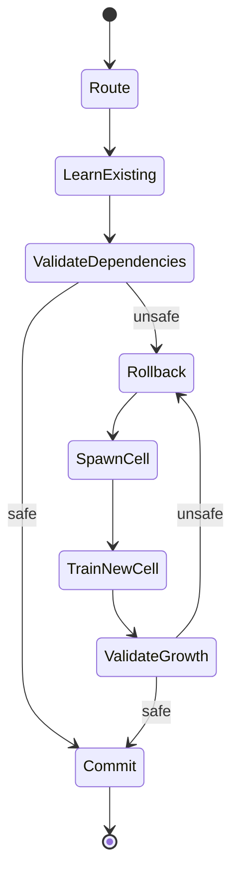

[English] | [中文](README.zh-CN.md)

# MiniCells

MiniCells is a research project exploring Cellular Language Models (CLMs): sparse networks of independently mutable and verifiable neural Cells that can learn locally, reject unsafe updates, and grow when existing Cells can no longer absorb new learning safely.

## What MiniCells is

MiniCells studies whether model state can be divided into routed computational units whose updates have explicit dependency and transaction boundaries. The current operational definition is:

$$\boxed{\text{Cell}=\text{independently routable}+\text{independently mutable}+\text{independently verifiable model state}}$$

NCA supplied the original local-state, local-interaction, growth, and self-organization perspective. The current CLM does not require a literal 2D grid; a sparse, dynamic Cell graph is the more general abstraction.

## Why Cells

Traditional mixture-of-experts routing primarily provides sparse compute. CLM also uses stable sparse routing as a dependency index: it identifies which historical computations must be checked when a Cell changes. Growth adds independently mutable state instead of forcing old state to absorb incompatible learning.

## Current Research Status

| Layer | Status |
|---|---|
| Cellular/NCA language dynamics | Historical experimental support |
| Sparse routed Cells | Experimental support |
| Dependency-scoped regression safety | Supported in a controlled synthetic setting |
| Transactional rollback | Supported as a safety mechanism |
| Growth-restored plasticity | **Supported — Core Validation 004, 3/3 seeds** |
| Natural-language continual learning | **Not yet validated** |
| 5–10M CLM-0.4 pilot | Next |
| 30–50M formal CLM-0.4 model | Planned after pilot |
| Distributed JAM-native CLM | Future work |

## CLM Core Loop

$$\boxed{\mathrm{CLM}=\mathrm{Sparse\ Routing}+\mathrm{Dependency\ Validation}+\mathrm{Transactional\ Learning}+\mathrm{Adaptive\ Cell\ Growth}}$$

## Experimental Evidence

Core Validation 002, 002B, and 002C rejected precise single-address, sparse-assembly, and oracle sparse-assembly writing as prerequisites. Core Validation 003 showed that dependency-scoped validation could reject unsafe candidates, but its official result remained a No-Go because rejection alone provided insufficient plasticity. Core Validation 004 added transactional growth and passed all registered formal seeds (`80411`, `80412`, `80413`).

The core CLM learning loop has been experimentally validated in a **controlled synthetic setting**. See the [final mechanism report](research/reports/clm-core-mechanism-0.4.md) and [canonical artifacts](artifacts/experiments/).

## What Has Been Validated

- Stable routing can scope affected historical computations under the registered synthetic conditions.
- Unsafe local candidates can be rolled back without false-safe or structural escape events in Core Validations 003/004.
- Growth can recover plasticity after an existing-Cell transaction is rejected; Core Validation 004 passed 3/3 seeds.

## What Has NOT Been Validated

MiniCells has not demonstrated general natural-language continual learning, solved catastrophic forgetting, established indefinitely bounded growth, or proven the mechanism at LLM scale. Core Validation 004 is not a production-readiness claim.

## Repository Structure

- [`research/`](research/README.md): four-stage history, catalog, final reports, protocols, and historical sources.
- [`artifacts/experiments/`](artifacts/experiments/): immutable canonical experimental evidence.
- [`research/minicells/`](research/minicells/): research implementation package.
- [`research/kaggle/`](research/kaggle/): experiment notebooks at stable historical paths.
- [`scripts/`](scripts/): experiment, reporting, and integrity utilities.
- [`tests/`](tests/): automated checks.

## Reproduce Research

Install the project dependencies, then run `python -m pytest -q` and `./tools/test_all.sh`. Each formal validation links its frozen protocol, notebook, and canonical artifact directory through [`research/catalog.yaml`](research/catalog.yaml). Do not regenerate formal result artifacts for documentation changes.

## MiniJAM / JAM Integration

Candidate update, validation, commit/rollback, and model-state transition map naturally to JAM-style deterministic transitions. The CLM mechanism was validated off-chain in controlled research experiments. JAM/MiniJAM is the intended distributed execution and state-transition environment, not part of the Core Validation 004 scientific result.

## Roadmap to CLM-0.4

The next step is a 5–10M-parameter controlled math-and-story language pilot covering the complete continual-learning lifecycle. A 30–50M formal release candidate follows only after a pilot Go. This repository freeze defines the baseline; it does not implement that training.

## License

See [LICENSE](LICENSE).
