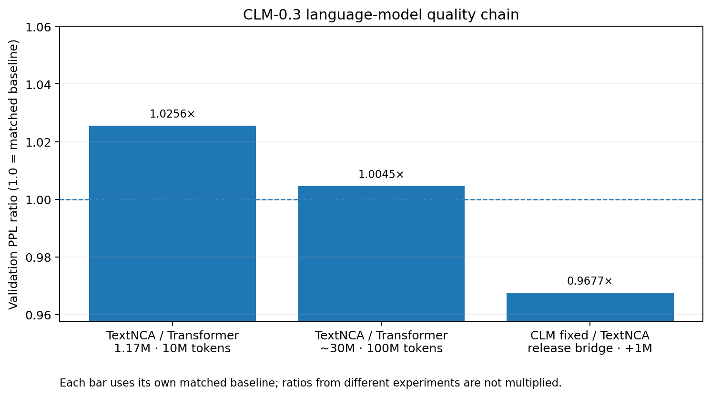
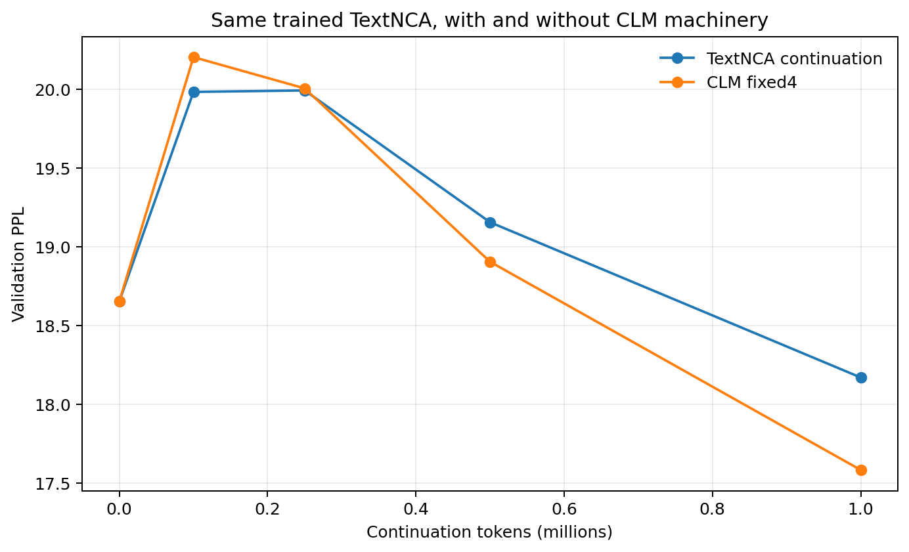
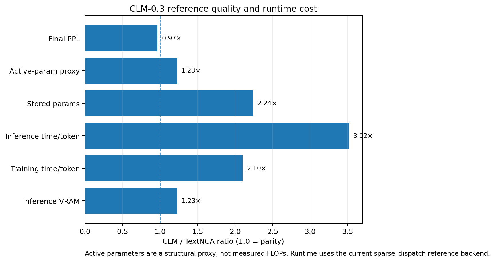
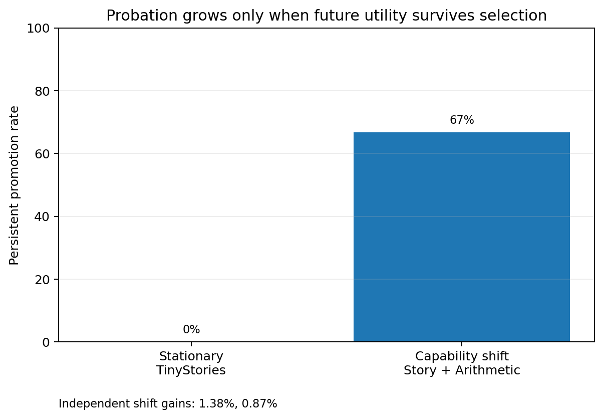

# CLM-0.3 Public Release Benchmark

**Release recommendation:** `CLM_0_3_PUBLIC_RESEARCH_RELEASE_READY`

CLM-0.3 adds a developmental capability to the TextNCA language-model substrate: a trained model can create function-preserving shadow lineages, let them develop under future experience, reject unnecessary structure, and promote persistent capacity only when the added lineage demonstrates sustained utility.

This release benchmark keeps two questions separate:

1. **Does the model remain a competitive language model?**
2. **Does it gain a capability that a fixed model does not have?**

## 1. Language-model foundation

Earlier matched-Transformer experiments are retained as immutable foundation evidence rather than retrained for this release.

| Evidence | TextNCA PPL | Transformer PPL | PPL ratio |
| --- | ---: | ---: | ---: |
| Experiment 006 — ~1.17M params, 10M tokens | 19.4487 | 18.9634 | 1.0256× |
| Experiment 007 — ~30M params, 100M tokens | 5.3532 | 5.3290 | 1.0045× |

At ~30M parameters / 100M training tokens, TextNCA was within **+0.45%** PPL of its parameter-matched Transformer.

## 2. Cost of becoming a CLM

The release bridge starts both arms from the exact same trained Experiment-006 10M TextNCA checkpoint and continues them for the same 1M unseen-suffix training-token budget.

| Metric | TextNCA continuation | CLM fixed4 | CLM / TextNCA |
| --- | ---: | ---: | ---: |
| Final validation PPL | 18.1699 | 17.5822 | 0.9677× |
| Total stored parameters | 1,170,816 | 2,619,904 | 2.24× |
| Active-parameter proxy | 1,170,816 | 1,434,496 | 1.23× |
| Training throughput | 19630 tok/s | 9350 tok/s | 0.48× |
| Inference throughput | 94844 tok/s | 26975 tok/s | 0.28× |
| Inference peak VRAM | 38.1 MiB | 46.8 MiB | 1.23× |

Language-quality status: `CLM_RELEASE_LM_QUALITY_COMPETITIVE`  
Reference-runtime status: `CLM_RELEASE_REFERENCE_RUNTIME_OPTIMIZATION_REQUIRED`

The active-parameter number is a structural proxy: shared parameters + one active expert per stage + router parameters. It is **not** a measured FLOP count. The current CLM inference measurement uses the repository's `sparse_dispatch` correctness/reference backend, not a fused production kernel.

## 3. Developmental capability

CLM-0.3d supplies the formal capability evidence used by this release:

- function-preserving shadow births: **72/72**;
- stationary continuation rejected persistent growth: **3/3** replicates;
- controlled capability shift promoted persistent growth: **2/3** replicates;
- independently confirmed promoted lineages: **r0 s1-e3 (1.38% lower PPL), r1 s1-e0 (0.87% lower PPL)**.

The central result is selectivity rather than unconditional expansion: under stationary continuation the probationary mechanism rejected all three persistent births, while a controlled capability shift produced independently confirmed promotion in two of three replicates.

## What CLM-0.3 supports

- A trained TextNCA can be converted into a fixed hierarchical CLM without changing its function at the conversion boundary.
- CLM language quality remains `CLM_RELEASE_LM_QUALITY_COMPETITIVE` relative to the same-checkpoint TextNCA continuation under the preregistered bridge.
- A trained CLM can create temporary shadow lineages and evaluate them over future data.
- The probationary controller can reject unnecessary persistent structure under stationary continuation.
- Under the formal controlled capability shift, persistent lineage promotion occurred in 2/3 replicates and survived an independent holdout.
- Persistent capacity can therefore be allocated after training according to demonstrated future utility rather than a fixed pretraining architecture alone.

## What CLM-0.3 does not claim

- It does not claim production-optimized sparse inference.
- It does not claim measured FLOP savings from the active-parameter proxy.
- It does not establish arbitrary-domain or arbitrary-capability generality.
- It does not establish repeated lifelong mitosis in one continuously developing organism; that is a CLM-0.4 question.
- It does not establish 30M-scale probationary growth. Experiment 007 is foundation evidence for the TextNCA substrate, not a 30M CLM growth experiment.

## Provenance

- Release-bridge training commit: `260df3a18116e1f38895790c5b24e14596f756c6`
- Release-bridge training tree: `430c793e850dd90b1c3400fb0f2fc45ede33427e`
- Source TextNCA checkpoint SHA-256: `b76e2dd28b31470c1ce8bcd265c56e1b306191631e304161ded55b4e763f9e9e`
- CLM-0.3d capability source ref: `kaggle/clm-0.3d-probationary-mitosis-results`
- CLM-0.3d capability source commit: `856f6a60d7db4b4eaca2fcac7ebc133a85719b9e`
- CLM-0.3d training commit: `af1eed85ac674495b684c22db49e839cf433bbe0`

Machine-readable evidence is in `decision.json`, `bridge-summary.json`, `historical-evidence.json`, and `capability-evidence.json`.
