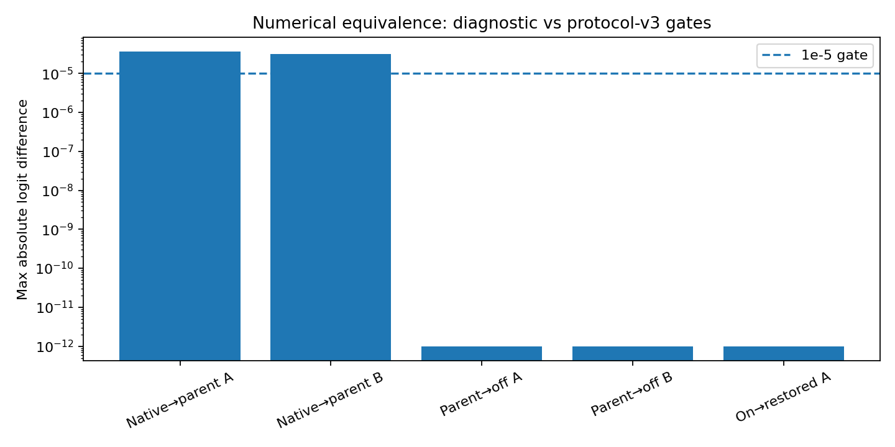
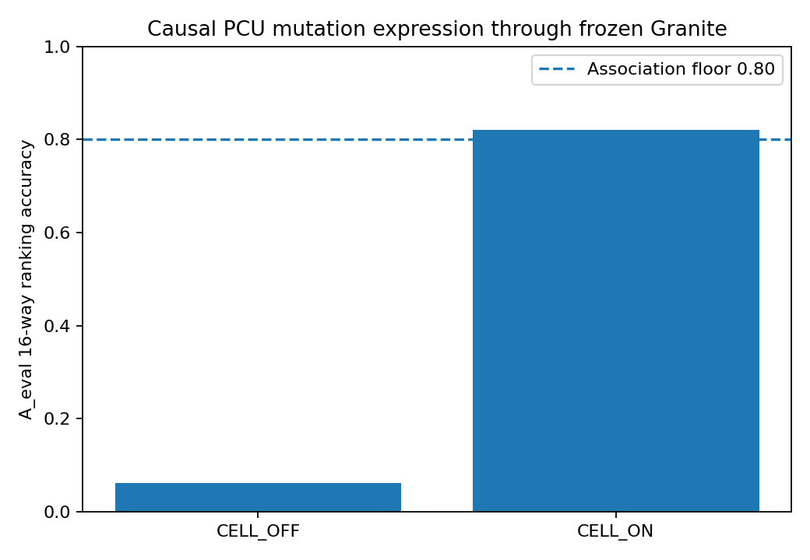
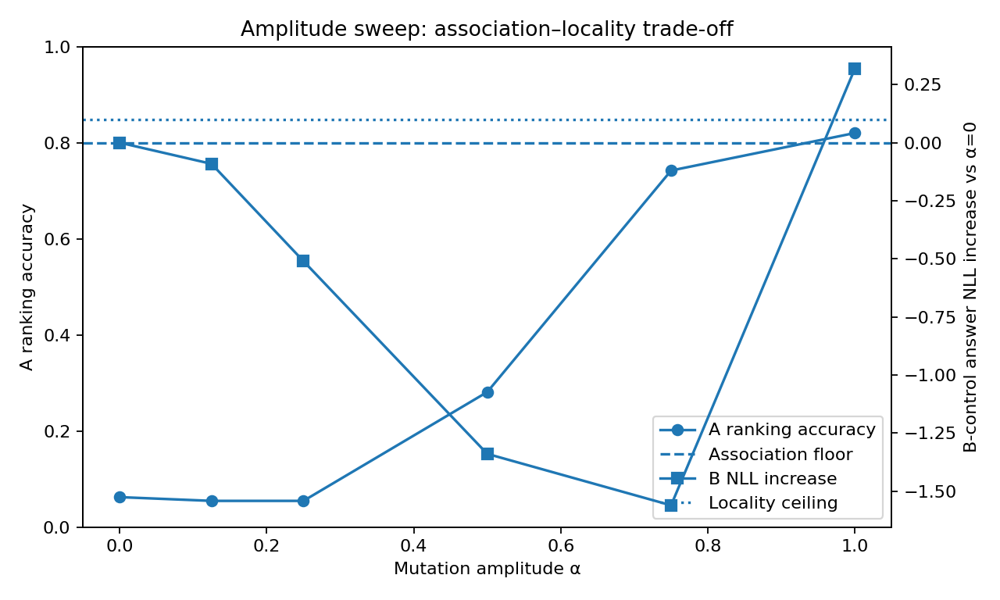
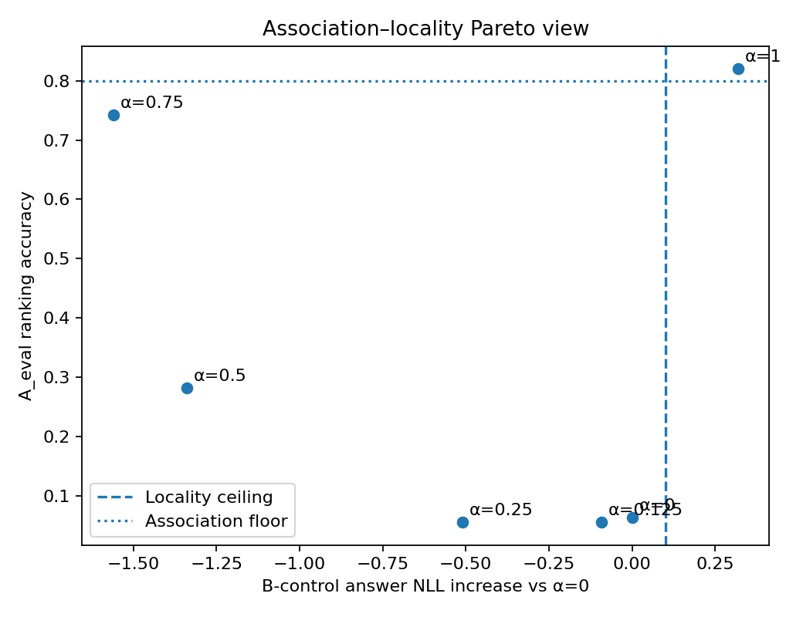

# PCU-HYBRID-REATTACHMENT-001 — Protocol v3 engineering report

Status: `HYBRID_CAUSAL_CONSUMPTION_SUPPORTED_LOCALITY_UNRESOLVED`

This run keeps all v2 numeric thresholds unchanged. The strict zero-state gate
is applied to `PARENT_ZERO_DELTA ↔ CELL_OFF`; native Granite ↔ cellularized
Granite remains a G0 numerical diagnostic.

## Primary causal arm

- Ranking OFF: 0.062500
- Ranking ON: 0.820312
- Ranking gain: 0.757812
- Answer margin gain: 3.183912
- A answer NLL gain: 3.467142
- B-control NLL increase: 0.318987
- Same-graph zero-state max logit diff: 0
- Native G0 max logit diff (diagnostic): 3.57627869e-05

## Amplitude sweep

- Grid: 0.0, 0.125, 0.25, 0.5, 0.75, 1.0
- Status: `AMPLITUDE_SWEEP_NO_LOCALITY_COMPATIBLE_POINT`
- Selected locality-compatible point: `None`
- No additional training, bridge, readout, or router was introduced.

## Visualizations

Formal seeds remain `RESERVED_UNTOUCHED`; this artifact is engineering evidence only.
