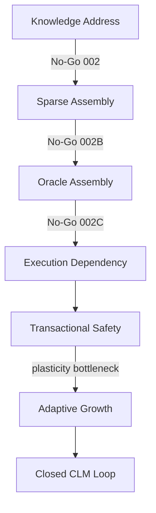
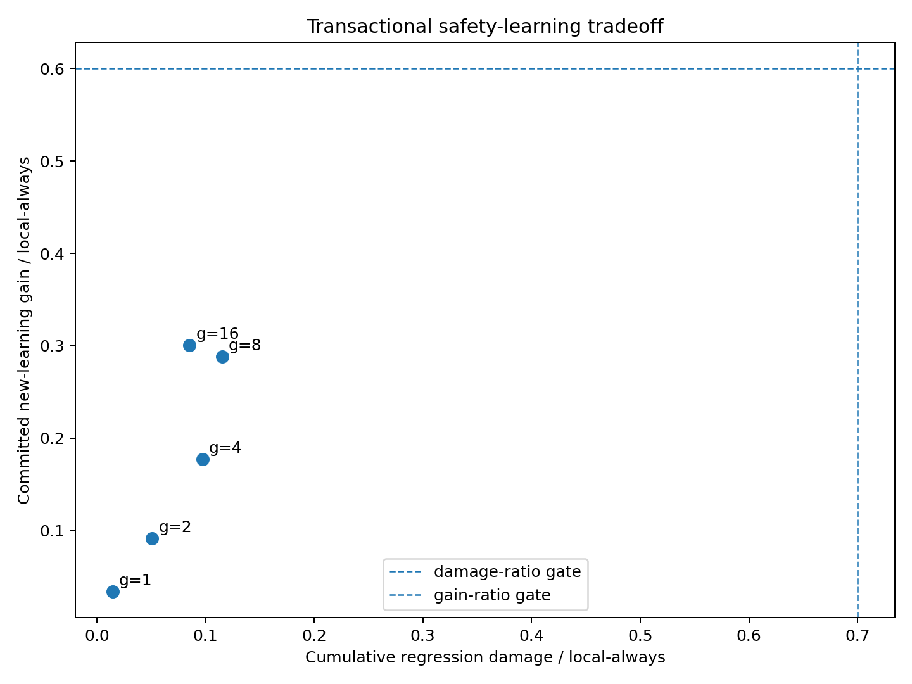
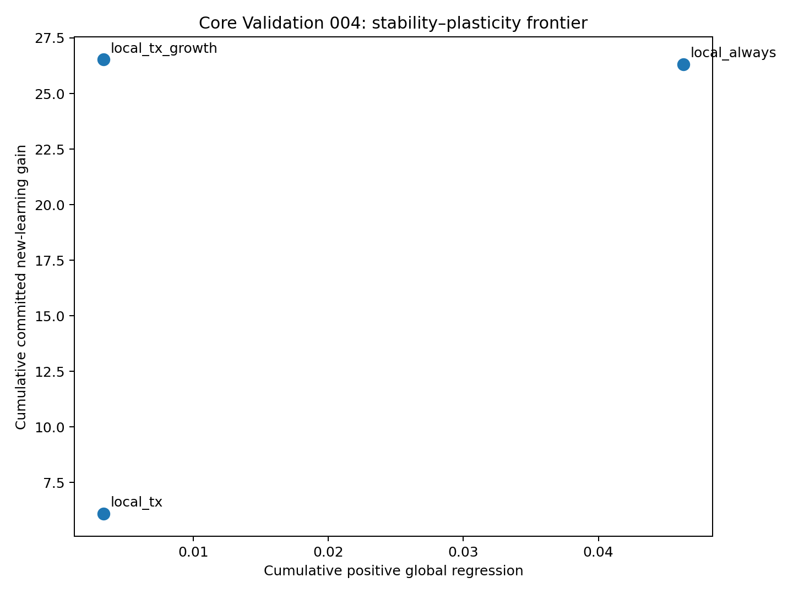
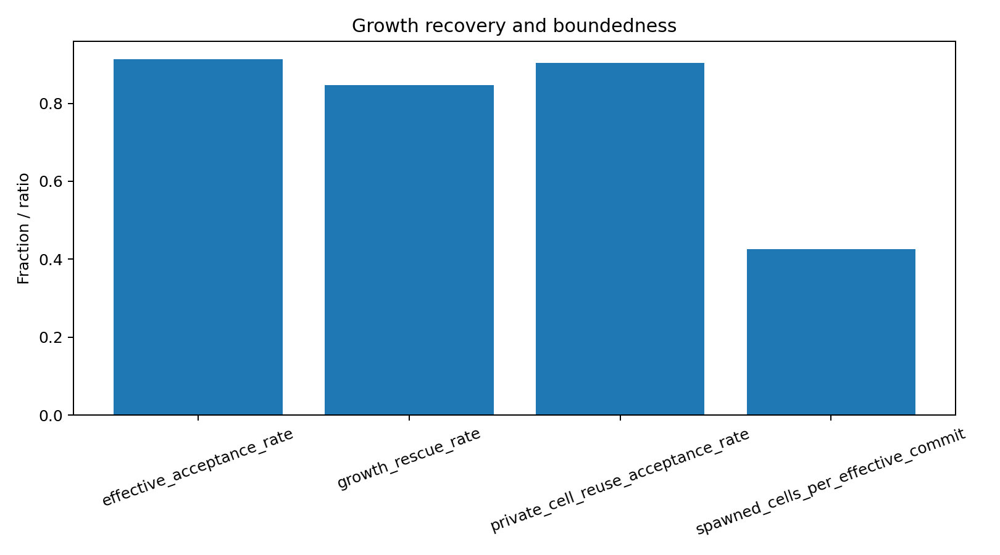
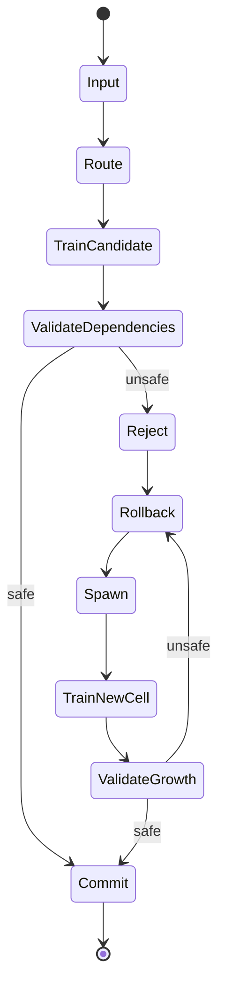

# CLM Core Mechanism 0.4
## Dependency-Scoped Transactional Learning with Growth-Restored Plasticity

## Abstract

This report freezes the final mechanism of the pre-0.4 phase. Core Validations 002–002C rejected precise functional write addressability as a prerequisite. Core Validation 003 showed that stable routing can define a dependency-scoped regression domain and that unsafe speculative updates can be rolled back, but its official result was No-Go because safety alone suppressed too much useful learning. Core Validation 004 added bounded, context-scoped Cell growth after rollback and passed all three registered seeds. The core CLM learning loop has therefore been experimentally validated in a **controlled synthetic setting**; natural-language and model-scale generalization remain open.

## 1. Problem

Continual learning must add useful behavior without silently damaging historical behavior. A monolithic update has no intrinsic boundary for determining which old computations might change, and a global regression suite becomes increasingly expensive. CLM asks whether sparse routed state can make both the update and its validation local enough to transact.

## 2. Why ordinary continual updates interfere

Parameters are reused across inputs. A gradient that improves incoming data can move shared state needed by earlier inputs. Locality of the optimizer operation does not imply locality of functional effect; without stable execution dependencies, a passing narrow test may be falsely safe.

## 3. Why write-addressability was investigated

The initial hypothesis was that each knowledge unit might possess a writable latent or Cell address:

$$\text{new knowledge}\rightarrow\text{specific writable latent / Cell}$$

If true, targeted writes might have combined fidelity and low leakage. It was a plausible but testable prerequisite, not an assumption to preserve.

## 4. Core Validation 002–002C

- **002:** `WRITE_ADDRESSABILITY_NOT_SUPPORTED`. Locality was strong, but update fidelity was insufficient.
- **002B:** `SPARSE_WRITE_ASSEMBLY_NOT_SUPPORTED`. Widening the sparse assembly did not solve the fidelity/leakage tradeoff.
- **002C:** `ORACLE_SPARSE_ASSEMBLY_NOT_SUPPORTED`. Even oracle tomography did not recover a sufficient sparse writable assembly.

These results do not say that learned representations contain nothing useful. They say that precise knowledge-addressable writing should not be treated as a prerequisite for the CLM continual-learning mechanism.

## 5. Shift from semantic addresses to execution dependencies

The question changed from “What knowledge is inside this parameter block?” to “Which historical computations depend on this block?” For Cell $C_i$:

$$D_i=\{x\mid C_i\in R(x)\}$$

For the Cells touched by an update, $B_t$:

$$D(B_t)=\bigcup_{C_i\in B_t}D_i$$

This is dependency-addressed rather than knowledge-addressed continual learning. Stable sparse routing acts as an execution index.

## 6. Dependency-scoped validation

Only historical inputs whose frozen routes use an updated Cell enter the primary regression domain. Under the registered synthetic conditions, this sharply reduced coverage as Cell granularity increased. It is safe only with the experiment's frozen routing and frozen shared-state assumptions; changes outside indexed Cells require a wider validation domain.

## 7. Transactional learning

Training produces speculative state. It is not visible as committed model state until both new-learning and dependency-regression gates pass. Failure restores parameters and associated state atomically. This separates *trying* a candidate from *accepting* it.

## 8. Core Validation 003

The frozen outcome is `DEPENDENCY_SCOPED_TRANSACTIONAL_LEARNING_NOT_SUPPORTED`. Gate-level evidence nevertheless showed `structural escape = 0` and `false-safe = 0` with frozen routing/shared state, and finer granularity substantially reduced dependency coverage. The registered top-level H2/H3/H4 booleans are coupled to the composite decision, so mechanistic interpretation uses the canonical gate and seed summaries without relabeling the overall No-Go.

## 9. Stability–plasticity bottleneck

003 established the central diagnosis:

$$\boxed{\text{Safety was available, but plasticity was insufficient.}}$$

Unsafe candidate updates could be rejected, but too much useful new learning was rejected with them. Rollback preserved old behavior by returning to the old model, not by finding a compatible place for the new behavior.

## 10. Growth as the missing degree of freedom

004 tested a new rule: when an existing Cell cannot absorb a candidate safely, roll it back, allocate a new Cell, add a monotonic context-scoped route, train the new state, validate the complete growth transaction, and commit or roll back atomically. Growth now has a specific computational role:

$$\boxed{\text{create new degrees of freedom when dependency constraints block safe learning}}$$

Operationally, mitosis means rejected absorption $\rightarrow$ allocation of new independently mutable state. It is more than a biological metaphor.

## 11. Core Validation 004

The frozen outcome is `GROWTH_RESTORED_PLASTICITY_SUPPORTED`. All registered seeds passed: `80411`, `80412`, `80413`. Its three registered high-level hypotheses—restored plasticity, preserved dependency-scoped safety, and bounded/reusable growth—were true under the registered experiment.

## 12. Final CLM state machine

Let $M_t=(\Theta_t,R_t,G_t)$, where $\Theta$ is Cell parameters, $R$ stable routing/addressing state, and $G$ the Cell graph/growth state. Given $D_t$, select $B_t=R_t(D_t)$ and produce speculative $\Theta'_t=T(\Theta_t,D_t)$. Validate:

$$V_t=\bigcup_{C_i\in B_t}D_i$$

If $\mathrm{NewGain}\ge\tau$ and $\mathrm{Regression}(V_t)\le\epsilon$, then $M_{t+1}=\mathrm{COMMIT}(M_t,\Delta\Theta)$. Otherwise roll back and attempt $G_t\rightarrow G_t+C_{\mathrm{new}}$ with monotonic extension $R_{t+1}=R_t+\Delta R$, subject to $R_{t+1}(x)=R_t(x)$ for unaffected historical inputs. The growth transaction is then validated and committed atomically or rolled back.

## 13. Formal invariants

1. **Speculation isolation:** a candidate cannot become committed before validation.
2. **Dependency coverage:** all indexed historical computations depending on touched Cells are in $V_t$.
3. **Atomic rollback:** rejected parameter, route, and growth changes leave committed state unchanged.
4. **Monotonic route extension:** growth does not rewrite unaffected historical routes.
5. **Structural locality:** updated state cannot escape the registered mutable boundary.
6. **Bounded activation:** the registered 004 experiment allowed a maximum of one active growth Cell per input.

These are registered-mechanism invariants, not claims about arbitrary routers or unbounded future operation.

## 14. Empirical results

Across-seed arithmetic means recomputed from the canonical 004 `gate-summary.csv` are:

| Metric | Mean |
|---|---:|
| Effective acceptance | 91.319% |
| Committed new-learning gain / `local_always` | 100.987% |
| Old-regression damage ratio / `local_always` | 7.749% |
| Growth rescue rate | 84.681% |
| Private Cell reuse acceptance | 90.417% |
| Spawned Cells | 37.333 |
| Spawned Cells / effective commit | 0.4260 |
| False-safe rate | 0 |
| Maximum structural escape | 0 |
| Maximum active growth Cells/input | 1 |

The comparisons among `local_always`, `local_tx`, and `local_tx_growth`, plus per-seed gain and regression, are plotted in the canonical figures above. Values are summaries, not new gates.

## 15. Limitations

| Question | Current answer |
|---|---|
| Can affected old computations be scoped by stable routing? | Supported in controlled setting |
| Can unsafe local updates be rejected? | Supported |
| Does rejection alone preserve sufficient plasticity? | No — 003 overall No-Go |
| Can growth restore plasticity? | Yes — 004 3/3 |
| Can spawned Cells be reused? | Supported in 004 |
| Is growth bounded forever? | Not established |
| Does semantic routing emerge automatically in language? | Not established |
| Does this work at 5–10M language-model scale? | Not yet tested |
| Does it work at LLM scale? | Unknown |
| Is literal 2D NCA necessary? | No evidence that it is required |
| Is JAM required for the learning mechanism? | No |
| Is JAM useful for distributed transactional execution? | Target architecture, not validated here |

## 16. Relationship to NCA / MoE

NCA supplied local-state transitions, local interaction, growth, and self-organization. Those ideas remain relevant for Cell dynamics, but a literal 2D grid is not required; a sparse dynamic graph may be more natural. Traditional MoE primarily supplies sparse compute. CLM additionally uses routing as dependency indexing and requires independently mutable and verifiable state. A Cell is therefore not merely a small expert.

## 17. Implications for CLM-0.4 language validation

The next phase is a 5–10M-parameter controlled math-and-story curriculum exercising the full route/train/validate/rollback/grow lifecycle at token level. Its purpose is to test whether the synthetic closed loop survives language modeling. Only after a pilot Go should a 30–50M controlled formal release candidate be attempted. JAM/MiniJAM is a target distributed state-transition environment, but 004 was validated off-chain and JAM is not part of its scientific result.

## 18. Conclusion

The pre-0.4 evidence supports a narrow but complete mechanism in the registered synthetic setting:

$$\boxed{\text{stable sparse routing}+\text{dependency-scoped validation}+\text{transactional update}+\text{growth-triggered plasticity recovery}}$$

It does not show that CLM solves continual learning in general. It provides a falsifiable, artifact-backed baseline for language-scale validation.
