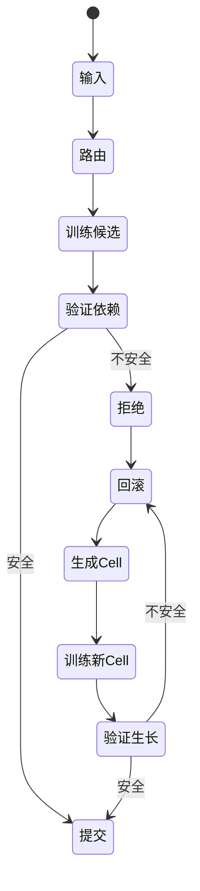

# CLM 核心机制 0.4
## 依赖域事务学习与生长恢复可塑性

## 摘要

本文冻结 pre-0.4 阶段的最终机制。Core Validation 002–002C 否定精确功能写地址作为前提；003 表明稳定路由可定义依赖域并回滚不安全候选，但因安全机制抑制了过多有效学习，官方结论仍为 No-Go；004 在回滚后加入有界、上下文域 Cell 生长，三个正式 seeds 全部通过。因此，**CLM 核心学习闭环已在受控合成环境中完成实验验证**，自然语言与模型规模泛化仍是开放问题。

## 1. 问题

持续学习必须增加新行为，同时避免静默破坏历史行为。普通参数会跨输入复用；优化步骤局部并不意味着功能影响局部。CLM 研究稀疏路由状态能否为更新和验证提供可事务化的边界。

## 2. 普通持续更新为何产生干扰

改善新数据的梯度可能移动旧输入依赖的共享状态。没有稳定执行依赖时，狭窄测试即使通过，也可能产生 false-safe。

## 3. 为什么研究写地址

初始假设是：$\text{新知识}\rightarrow\text{特定可写 latent / Cell}$。若成立，定向写入或可兼顾 fidelity 与低 leakage；它是待检验前提，不是必须保留的假设。

## 4. Core Validation 002–002C

- 002：`WRITE_ADDRESSABILITY_NOT_SUPPORTED`；局部性强，但更新 fidelity 不足。
- 002B：`SPARSE_WRITE_ASSEMBLY_NOT_SUPPORTED`；扩大稀疏 assembly 未解决问题。
- 002C：`ORACLE_SPARSE_ASSEMBLY_NOT_SUPPORTED`；oracle tomography 也未找到足够的稀疏可写 assembly。

这不表示表征没有有用信息，而是说明精确知识地址写入不应作为 CLM 的必要前提。

## 5. 从语义地址转向执行依赖

问题从“参数块内是什么知识？”转为“哪些历史计算依赖该块？”：

$$D_i=\{x\mid C_i\in R(x)\},\qquad D(B_t)=\bigcup_{C_i\in B_t}D_i$$

稳定稀疏路由由此成为执行索引，形成 dependency-addressed continual learning。

## 6. 依赖域验证

只有冻结路由使用被更新 Cell 的历史输入进入主要回归域。粒度增加显著降低覆盖范围。该结论依赖注册实验中的冻结路由与冻结共享状态假设；边界外状态改变需要更宽验证域。

## 7. 事务学习

训练先产生 speculative state。只有新学习与依赖回归 gate 同时通过，状态才提交；失败时参数、路由及相关状态原子恢复，从而分离“尝试”与“接受”。

## 8. Core Validation 003

冻结结论是 `DEPENDENCY_SCOPED_TRANSACTIONAL_LEARNING_NOT_SUPPORTED`。Gate 级证据在冻结路由/共享状态下显示 `structural escape = 0`、`false-safe = 0`，且粒度降低依赖覆盖。H2/H3/H4 顶层布尔值与 composite decision 耦合，因此机制解释依据规范 gate/seed summaries，但不改变 No-Go。

## 9. 稳定性—可塑性瓶颈

$$\boxed{\text{安全已经可用，但可塑性不足。}}$$

不安全候选可以拒绝，但大量有用的新学习也随之被拒绝。回滚只会返回旧模型，并不会为新行为寻找兼容空间。

## 10. 生长作为缺失自由度

004 的规则是：已有 Cell 无法安全吸收候选时，回滚、分配新 Cell、增加单调的上下文域路由、训练并验证完整生长事务，最后原子提交或回滚。

$$\boxed{\text{当依赖约束阻止安全学习时，创建新的自由度}}$$

“Mitosis”在操作上是吸收被拒后分配新的可独立修改状态，不再只是生物比喻。

## 11. Core Validation 004

冻结结论为 `GROWTH_RESTORED_PLASTICITY_SUPPORTED`。正式 seeds `80411`、`80412`、`80413` 全部通过；恢复可塑性、保持依赖域安全及有界/可复用生长三个注册高层假设均在该实验内成立。

## 12. 最终 CLM 状态机

令 $M_t=(\Theta_t,R_t,G_t)$，分别表示 Cell 参数、稳定路由/地址状态和 Cell 图/生长状态。对 $D_t$ 选择 $B_t=R_t(D_t)$，生成 $\Theta'_t=T(\Theta_t,D_t)$，并验证 $V_t=\bigcup_{C_i\in B_t}D_i$。若 $\mathrm{NewGain}\ge\tau$ 且 $\mathrm{Regression}(V_t)\le\epsilon$，提交；否则回滚并尝试 $G_t\rightarrow G_t+C_{new}$。路由单调扩展 $R_{t+1}=R_t+\Delta R$，对未受影响历史输入满足 $R_{t+1}(x)=R_t(x)$，生长事务再原子验证和提交/回滚。

## 13. 形式不变量

候选提交前隔离；被修改 Cell 的索引历史依赖全部进入验证域；拒绝后参数/路由/生长原子恢复；生长不改写未受影响历史路由；更新不逃逸注册可变边界；004 中每输入最多激活一个 growth Cell。这些是注册机制不变量，不是对任意 router 或无限未来的保证。

## 14. 实验结果

从规范 `gate-summary.csv` 重算三 seed 算术平均：

| 指标 | 平均值 |
|---|---:|
| Effective acceptance | 91.319% |
| Committed gain / `local_always` | 100.987% |
| Old-regression damage / `local_always` | 7.749% |
| Growth rescue | 84.681% |
| Private Cell reuse acceptance | 90.417% |
| Spawned Cells | 37.333 |
| Spawned Cells / effective commit | 0.4260 |
| False-safe | 0 |
| 最大 structural escape | 0 |
| 每输入最大 active growth Cells | 1 |

## 15. 局限与开放问题

| 问题 | 当前答案 |
|---|---|
| 稳定路由能否限定受影响旧计算？ | 受控环境中支持 |
| 能否拒绝不安全局部更新？ | 支持 |
| 仅拒绝能否保持足够可塑性？ | 否——003 总体 No-Go |
| 生长能否恢复可塑性？ | 是——004 3/3 |
| Spawned Cells 能否复用？ | 004 中支持 |
| 生长是否永久有界？ | 未建立 |
| 语言中语义路由是否自动涌现？ | 未建立 |
| 5–10M 语言模型规模是否成立？ | 尚未测试 |
| LLM 规模是否成立？ | 未知 |
| 是否需要字面二维 NCA？ | 没有其为必要条件的证据 |
| 学习机制是否需要 JAM？ | 不需要 |
| JAM 是否适合分布式事务执行？ | 目标架构，本文未验证 |

## 16. 与 NCA / MoE 的关系

NCA 提供局部状态、局部交互、生长和自组织视角；二维网格不是必要条件，稀疏动态图可能更自然。传统 MoE 主要提供稀疏计算，CLM 还把路由用于依赖索引，并要求状态可独立修改和验证，因此 Cell 不只是“小 Expert”。

## 17. 对 CLM-0.4 语言验证的意义

下一阶段用 5–10M 参数、受控数学+故事 curriculum 测试 token 级完整生命周期；只有 pilot Go 后才尝试 30–50M 正式候选。JAM/MiniJAM 是目标分布式状态迁移环境，但 004 是链下受控实验。

## 18. 结论

Pre-0.4 证据在注册合成环境中支持：

$$\boxed{\text{稳定稀疏路由}+\text{依赖域验证}+\text{事务更新}+\text{生长触发的可塑性恢复}}$$

这不代表 CLM 已解决通用持续学习，而是为语言规模验证提供可证伪、可追溯的基线。
