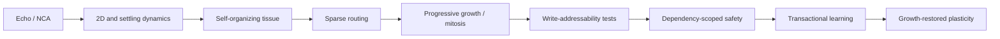
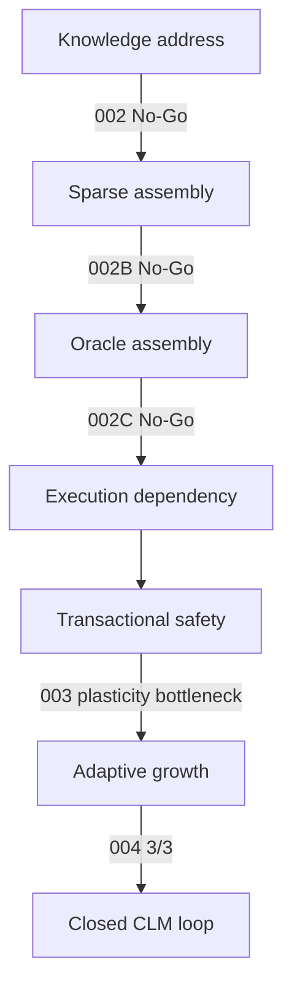

# MiniCells / CLM Research History 0.4

## 1. Executive Summary

MiniCells progressed from cellular language dynamics to a controlled continual-learning state machine. Early NCA work supplied local state, interaction, growth, and self-organization; routing work converted a Cell from biological analogy into independently mutable model state. Core Validations 002–002C then falsified precise write-addressability as a prerequisite. Validation 003 found dependency-scoped transactional safety but insufficient plasticity. Validation 004 supplied the missing growth path and passed 3/3 formal seeds. The resulting loop is validated only in a controlled synthetic setting.



## 2. Original Question

Could language computation be organized as local, recurrent cellular dynamics whose components adapt without destabilizing the whole model? The question initially mixed representation, self-organization, and continual learning. Successive experiments separated them into testable mechanisms.

## 3. Stage 1 — Foundations

Echo and experiments roughly 001–013 tested TextNCA, native trainability, 1D/2D latent tissue, adaptive halting, settling, stabilization cost, and random-depth controls. Local recurrent computation transferred enough to language to justify further study, but training stability, compute, and quality limited it. No true continual-learning claim follows from this stage. Reusable outcomes were local-state machinery, controlled ablations, multiseed evaluation, and the insight that dynamics must be measured rather than inferred from visual analogy.

## 4. Stage 2 — Self-Organization

Experiments 014–024 asked whether useful organization could emerge. They explored multiseed stabilization, sparse topology, reaction–diffusion-style plasticity, growth, localized learning, recruitment, capability specificity, conflict-driven differentiation, trait genesis, and probation. Some runs produced interesting sparse and differentiated behavior; null modes and numerical failures were equally informative. Emergence did not itself validate continual learning. Conditional recruitment, locality, probation, and pressure-driven growth became reusable design elements.

## 5. Stage 3 — Routing and Growth

Experiment 025/026, CLM upcycling, CLM-0.1/v2, progressive growth, marginal utility, counterfactual and probationary mitosis, and sparse runtime work changed the Cell abstraction:

```text
cell as biological analogy
→ cell as routed computational unit
→ cell as independently mutable model state
```

This was the conceptual bridge to transactional validation. NCA remained relevant to local dynamics; growth began to mean capacity allocation, and a literal 2D grid ceased to be a prerequisite.

## 6. Stage 4 — Continual-Learning Core

Core Validation 001/001B examined knowledge subsumption and residual memorization. Core Validation 002 asked for precise writable addresses and returned `WRITE_ADDRESSABILITY_NOT_SUPPORTED`. 002B widened the address to a sparse assembly and returned `SPARSE_WRITE_ASSEMBLY_NOT_SUPPORTED`. Oracle 002C returned `ORACLE_SPARSE_ASSEMBLY_NOT_SUPPORTED`.

The project then replaced semantic addressing with execution dependency. For $D_i=\{x\mid C_i\in R(x)\}$ and updated Cells $B_t$, the validation domain is $D(B_t)=\bigcup_{C_i\in B_t}D_i$. Validation 003 showed zero false-safe and structural escape events under registered frozen-state assumptions and reduced coverage through granularity, yet remained `DEPENDENCY_SCOPED_TRANSACTIONAL_LEARNING_NOT_SUPPORTED` because useful learning was rejected too often. Validation 004 rolled back unsafe absorption and allocated new context-scoped Cell state. It returned `GROWTH_RESTORED_PLASTICITY_SUPPORTED` on seeds `80411`, `80412`, and `80413`.

## 7. Hypothesis Evolution



The negative experiments reduced the hypothesis space. The project did not always know growth would work: write addressability was falsified, dependency safety exposed the stability–plasticity bottleneck, and only then was growth registered as the missing degree of freedom.

## 8. Major Negative Results

- 002: locality did not provide adequate write fidelity.
- 002B: larger sparse assemblies did not solve the tradeoff.
- 002C: oracle knowledge of representation geometry did not rescue sparse writing.
- 003: rejection provided safety but insufficient plasticity; its official overall result remains No-Go.

These are canonical scientific results, not preliminary inconveniences to hide.

## 9. Major Positive Results

Stable routing supported dependency indexing under frozen-state conditions. Transactional rollback rejected unsafe candidate state without observed false-safe or structural escape events in the registered 003/004 experiments. Validation 004 restored effective acceptance through bounded context-scoped growth and demonstrated reuse of private spawned Cells, passing all formal seeds.

## 10. Current CLM Definition

$$\boxed{\mathrm{CLM}=\mathrm{Sparse\ Routing}+\mathrm{Dependency\ Validation}+\mathrm{Transactional\ Learning}+\mathrm{Adaptive\ Cell\ Growth}}$$

The controlled loop routes, trains an existing Cell candidate, validates dependencies, commits if safe, or rolls back, grows, trains, validates, and atomically commits/rolls back. Full formalization is in the [mechanism report](clm-core-mechanism-0.4.md).

## 11. What Remains Unvalidated

No experiment yet demonstrates general natural-language continual learning, automatic semantic routing in language, indefinite growth bounds, 5–10M language-scale operation, LLM-scale operation, or JAM-native distributed execution. A 2D NCA grid is not known to be necessary. JAM is a target execution architecture, not part of the 004 result.

## 12. Transition to CLM-0.4

The pilot is a 5–10M-parameter controlled math-and-story curriculum testing the full lifecycle at token level. Its question is whether the synthetic closed-loop mechanism survives language modeling. A 30–50M controlled formal candidate is conditional on a pilot Go. This consolidation freezes the baseline and does not implement either run.

## 13. Reproducibility Index

- Machine-readable catalog: [`research/catalog.yaml`](../catalog.yaml)
- Core protocols and summaries: [`research/validations/`](../validations/)
- Immutable canonical evidence: [`artifacts/experiments/`](../../artifacts/experiments/)
- Stable notebooks: [`research/kaggle/`](../kaggle/)
- Historical source documents: [`research/stages/*/sources/`](../stages/)
- Pre-cleanup branch audit: [`research/archive/branch-manifest-pre-0.4.json`](../archive/branch-manifest-pre-0.4.json)
- Legacy path map: [`research/archive/legacy-path-map.csv`](../archive/legacy-path-map.csv)
