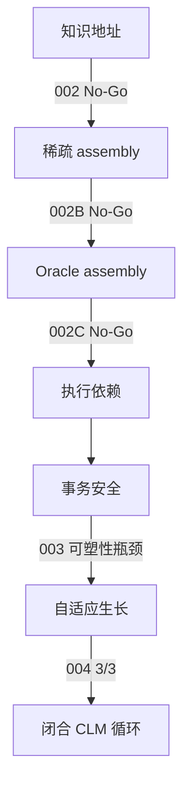

# MiniCells / CLM 研究历史 0.4

## 1. 执行摘要

MiniCells 从细胞式语言动力学发展到受控持续学习状态机。早期 NCA 提供局部状态、交互、生长和自组织视角；路由研究把 Cell 从生物类比转为可独立修改的模型状态。Core Validation 002–002C 否定精确写地址作为前提，003 得到依赖域事务安全但可塑性不足，004 补上生长路径并通过 3/3 正式 seeds。最终闭环仅在受控合成环境中得到验证。


## 2. 原始问题

语言计算能否组织为局部、循环的细胞动力学，使组件适应而不破坏整体？最初问题混合了表征、自组织和持续学习；连续实验逐步将它们拆成可检验机制。

## 3. 阶段 1——基础

Echo 与约 001–013 检验 TextNCA、原生可训练性、1D/2D latent tissue、自适应停止、settling、稳定化成本和随机深度对照。局部循环计算足以支持继续研究，但训练稳定性、成本和质量受限。本阶段不能推出真正持续学习；可复用成果是局部状态工具、受控消融、多 seed 评估和以机制指标代替视觉类比。

## 4. 阶段 2——自组织

014–024 研究多 seed 稳定化、稀疏拓扑、反应扩散式可塑性、生长、局部学习、招募、能力特异性、冲突驱动分化与 trait genesis。稀疏和分化行为很有意义，null mode 与数值失败同样重要。涌现本身并不验证持续学习；条件招募、局部性、probation 和压力驱动生长被保留。

## 5. 阶段 3——路由与生长

025/026、CLM upcycling、CLM-0.1/v2、渐进生长、边际效用、反事实/试用期 mitosis 与稀疏 runtime 形成关键转变：

```text
生物类比中的 cell → 路由计算单元 → 可独立修改的模型状态
```

这成为事务验证的概念桥梁。NCA 仍适用于局部动力学；生长开始表示容量分配，字面二维网格不再是前提。

## 6. 阶段 4——持续学习核心

001/001B 研究知识包含与残余记忆。002、002B、002C 分别得到 `WRITE_ADDRESSABILITY_NOT_SUPPORTED`、`SPARSE_WRITE_ASSEMBLY_NOT_SUPPORTED`、`ORACLE_SPARSE_ASSEMBLY_NOT_SUPPORTED`。

随后研究从语义地址转向执行依赖：$D_i=\{x\mid C_i\in R(x)\}$，被更新 Cell 集 $B_t$ 的验证域为 $D(B_t)=\bigcup_{C_i\in B_t}D_i$。003 在注册冻结状态假设下没有 false-safe 或 structural escape，并通过粒度降低覆盖，但因有效学习被过度拒绝，仍为 `DEPENDENCY_SCOPED_TRANSACTIONAL_LEARNING_NOT_SUPPORTED`。004 回滚不安全吸收并分配上下文域新 Cell，在 `80411`、`80412`、`80413` 上得到 `GROWTH_RESTORED_PLASTICITY_SUPPORTED`。

## 7. 假设演化



负结果缩小了假设空间。项目并非预先知道生长会成功：写地址被否定，依赖安全暴露稳定性—可塑性瓶颈，之后才注册生长作为缺失自由度。

## 8. 主要负结果

002 的局部性不能提供足够写入 fidelity；002B 扩大 assembly 未解决 tradeoff；002C 的 oracle 几何信息也未挽救稀疏写入；003 的拒绝保证安全却不能保持足够可塑性，官方结论保持 No-Go。这些是规范科学结果，不能隐藏。

## 9. 主要正结果

稳定路由在冻结状态条件下支持依赖索引；事务回滚在注册 003/004 中拒绝不安全候选，未观察到 false-safe 或 structural escape；004 通过有界上下文生长恢复有效接受并复用 private Cells，三个正式 seeds 全部通过。

## 10. 当前 CLM 定义

$$\boxed{\mathrm{CLM}=\text{稀疏路由}+\text{依赖验证}+\text{事务学习}+\text{自适应 Cell 生长}}$$

闭环先路由并训练已有 Cell 候选，依赖验证安全则提交；否则回滚、生长、训练、验证并原子提交/回滚。形式定义见[机制报告](clm-core-mechanism-0.4.zh-CN.md)。

## 11. 尚未验证

尚无实验表明通用自然语言持续学习、语言中自动语义路由、无限期有界生长、5–10M 或 LLM 规模有效性以及 JAM 原生分布式执行。二维 NCA 网格没有被证明为必要条件；JAM 是目标执行架构，不属于 004 结论。

## 12. 转向 CLM-0.4

Pilot 使用 5–10M 参数、受控数学+故事 curriculum，在 token 级测试完整生命周期；只有 pilot Go 后才尝试 30–50M 正式候选。本次整理冻结基线，不实现训练。

## 13. 复现索引

- 机器目录：[`research/catalog.yaml`](../catalog.yaml)
- 协议与摘要：[`research/validations/`](../validations/)
- 规范证据：[`artifacts/experiments/`](../../artifacts/experiments/)
- 稳定 notebook 路径：[`research/kaggle/`](../kaggle/)
- 历史来源：[`research/stages/*/sources/`](../stages/)
- 分支审计：[`research/archive/branch-manifest-pre-0.4.json`](../archive/branch-manifest-pre-0.4.json)
- 旧路径映射：[`research/archive/legacy-path-map.csv`](../archive/legacy-path-map.csv)
